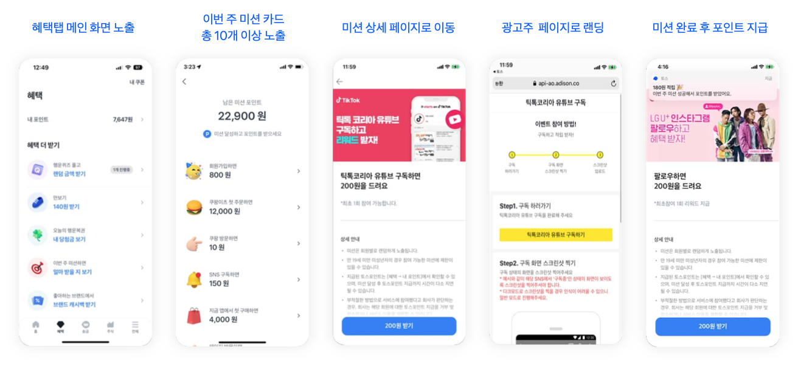

# Toss 如何用日常金融入口與社群信任，驅動證券用戶增長

> 整理日期：2026-05-04  
> 核心問題：Toss 如何透過社群機制推動證券業務成長？

---

## TL;DR

1. **Toss 用 super app 的日常金融入口養成高頻使用，再把投資場景放進同一條低摩擦路徑；證券社群負責補上投資決策中的信任、回訪與內容供給。**
2. **Rewards 的價值不是點數，而是每日打開理由。** Toss 把走路、支付、任務、廣告、分享、養成進度包成低門檻任務，讓用戶形成「今天也可以打開看一下」的習慣。
3. **Today’s Tip 讓非交易日也有金融內容 ritual。** 8 億 views、790 萬訂閱說明 Toss 不只靠金融工具留存，也靠每日 quiz、card news、生活化金融知識建立「Toss 幫我理解金融」的心智。
4. **Toss Securities 的社群核心是認證信任，不是匿名熱鬧。** 股東認證、收益率、資產 badge、follow 關係把真實金融行為變成社群信任訊號；但 badge 不能變成績效背書，否則會有跟單與公平性風險。
5. **Conversion as Content 是 Toss 最值得學的增長結構。** 贈股、抽獎、結果頁、分享卡把開戶 / 持股結果變成可截圖、可討論、可轉傳的內容，讓轉換不是漏斗終點，而是下一輪回訪與導流的起點。

**本節參考資料**

- [Toss 英文官網](https://toss.im/en)：Toss 將自己定位為 unified financial platform，證券、支付、轉帳、信用、稅務、保險都在同一日常金融入口下。
- [Today’s Tip 官方報導](https://toss.im/tossfeed/article/Todaystip)：Toss 內容服務累積 8 億 views、790 萬訂閱，說明內容本身也是日常回訪引擎。
- [Toss Product Principles](https://toss.im/tossfeed/article/tossproductprinciples)：官方明確把 Simplicity 作為產品原則核心。

---

## 目錄

1. [重新定義 Toss 增長模型](#1-重新定義-toss-增長模型)
   - [1.1 Toss 增長模型定義](#11-toss-增長模型定義)
   - [1.2 Toss Growth Stack](#12-toss-growth-stack)
     - [1.2.1 Home：金融狀態與下一步行動](#121-home金融狀態與下一步行動)
     - [1.2.2 Rewards / 혜택：高頻打開與商業化](#122-rewards--혜택高頻打開與商業化)
     - [1.2.3 Today’s Tip：金融知識內容儀式](#123-todays-tip金融知識內容儀式)
     - [1.2.4 Securities：高 LTV 投資目的地](#124-securities高-ltv-投資目的地)
     - [1.2.5 Badge & 認證：信任與回訪](#125-badge--認證信任與回訪)
     - [1.2.6 Conversion as Content：開戶 / 贈股 / 結果可分享](#126-conversion-as-content開戶--贈股--結果可分享)
   - [1.3 Toss 增長飛輪](#13-toss-增長飛輪)
     - [1.3.1 Toss 增長實驗方法論](#131-toss-增長實驗方法論)
2. [Toss Product Design：不是一套系統，是能力堆疊](#2-toss-product-design不是一套系統是能力堆疊)
   - [2.1 Product Principles：Simplicity 是 UX critique checklist](#21-product-principlessimplicity-是-ux-critique-checklist)
   - [2.2 Toss 如何善用動畫與 interaction](#22-toss-如何善用動畫與-interaction)
   - [2.3 Toss 在 UX Writing A/B test 下的心力](#23-toss-在-ux-writing-ab-test-下的心力)
3. [Securities：內容、新聞、交易的低摩擦相鄰](#3-securities內容新聞交易的低摩擦相鄰)
   - [3.1 Toss Securities 定位](#31-toss-securities-定位)
   - [3.2 News Feed / Top Stories / Today’s Discovery](#32-news-feed--top-stories--todays-discovery)
   - [3.3 初學者友善 vs 專業深度不足](#33-初學者友善-vs-專業深度不足)
4. [Community：社群不是熱鬧，是信任基建](#4-community社群不是熱鬧是信任基建)
   - [4.1 官方歷史數據：follow 才是真槓桿](#41-官方歷史數據follow-才是真槓桿)
   - [4.2 Trust Signal Layer](#42-trust-signal-layer)
5. [Case Study：同學會每日簽到改版](#5-case-study同學會每日簽到改版)
   - [5.1 重新 framing：問題不是簽到，而是日打開後沒有價值](#51-重新-framing問題不是簽到而是日打開後沒有價值)
   - [5.2 方案 A：今日為您卡片](#52-方案-a今日為您卡片)
   - [5.3 方案 B：每日可信作者推薦](#53-方案-b每日可信作者推薦)
   - [5.4 方案 C-lite：可分享投資結果卡](#54-方案-c-lite可分享投資結果卡)
   - [5.5 推薦方案](#55-推薦方案)
6. [風險與限制](#6-風險與限制)
7. [結語：可複製的是結構，不是功能](#7-結語可複製的是結構不是功能)
8. [附錄](#8-附錄)
   - [8.1 參考資料](#81-參考資料)
   - [8.2 UI 截圖](#82-ui-截圖按照資訊架構整理)
     - [8.2.1 Home / Spending](#821-home--spending)
     - [8.2.2 Money Transfer / Safety](#822-money-transfer--safety)
     - [8.2.3 Rewards / Payment](#823-rewards--payment)
     - [8.2.4 Securities](#824-securities)
     - [8.2.5 Community / Badge & 認證](#825-community--badge--認證)
     - [8.2.6 Savings / Good Emotion Design](#826-savings--good-emotion-design)
     - [8.2.7 Viral / Toss Challengers](#827-viral--toss-challengers)
     - [8.2.8 Video / Presentation Sources](#828-video--presentation-sources)

---

# 1. 重新定義 Toss 增長模型

## 1.1 Toss 增長模型定義

Toss 證券用戶成長邏輯：

> **Toss 用 super app 的日常金融入口養成高頻使用，再把投資場景放進同一條低摩擦路徑；證券社群負責補上投資決策中的信任、回訪與內容供給。**

這個模型有三個層次：

| 層次 | Toss 的做法 | 對證券的作用 |
|---|---|---|
| Daily Entry | Home、轉帳、消費、Rewards、Today’s Tip | 讓用戶每天有理由打開 Toss |
| Investing Destination | Securities、Today’s Discovery、News Feed、股票搜尋與買賣 | 把高頻金融入口轉成高 LTV 投資場景 |
| Trust & Content Layer | Securities 內的 Community、follow、股東認證、收益率訊號、AI / 人工整理內容 | 讓沉默用戶也能透過閱讀、追蹤、比較來參與投資社群 |

因此，Toss 的證券增長不是「社群導流到開戶」的單向模型，而是「Securities 承接投資需求，Community 在其中建立信任與回訪」的循環模型：

```text
日常金融打開
  ↓
內容 / Rewards / 通知維持回訪
  ↓
用戶在同一 App 內接觸投資資訊
  ↓
Securities 成為投資目的地
  ├── News / Discovery：讓用戶先看懂市場與個股
  ├── Community / Follow：讓用戶追蹤可信作者與討論
  └── 開戶 / 交易 / 資產查看：承接已準備好的投資行為
  ↓
持股、收益、股東認證、作者觀點變成社群信任訊號
  ↓
信任訊號帶動回訪、追蹤、交易與開戶意圖
```

Toss 在 2021 年 3 月推出 Securities，透過拉一個好友就送一股的 MGM 機制（주식 1주 선물받기），5 月已達 300 萬帳戶，當時官方說明 Community 即將推出；到 2024 年 3 月，社群 MAU 130 萬，其中 75% 活動用戶掛有股東認證 badge。這代表社群不是純內容池，而是大量連動真實持股身份的投資信任基建。

**對同學會 x 口袋證券的意義**

如果同學會只複製 Toss 的「社群外觀」，會漏掉最重要的前置層：每日打開理由。同學會需要回答的不是「怎麼讓更多人發文」，而是：如何在用戶每天打開後，給他一則有相關、看得懂、用得上的投資觀察

**本節參考資料**

- [Toss 英文官網](https://toss.im/en)：官方將 Toss 描述為涵蓋帳戶、轉帳、證券、支付、稅務、保險與生活金融的 unified platform。
- [Toss Securities News Feed](https://www.tossinvest.com/feed/news?menu=news)：新聞 feed 直接綁股票 tag、漲跌幅與個股 order link，顯示內容與交易情境高度相鄰。
- [Toss Feed：300 萬帳戶與 Community 即將推出](https://toss.im/tossfeed/article/securities-30bn-mts)：證明 Toss Securities 先建立帳戶與 MTS 基礎，再把 Community 放進投資情境。
- [Metro Seoul：社群 MAU 130 萬、75% 股東認證](https://www.metroseoul.co.kr/article/20240404500279)：支持 Community 是連動真實持股身份的 trust layer。
- [Today’s Tip 官方報導](https://toss.im/tossfeed/article/Todaystip)：證明 Toss 不只做金融工具，也長期經營內容訂閱與每日知識服務。

## 1.2 Toss Growth Stack

Toss 的增長堆疊可以拆成六個層面：Home、Rewards、Today’s Tip、Securities、Community / Follow、Conversion as Content。

### 1.2.1 Home：金融狀態與下一步行動

Home 是 Toss 的日常入口，不是功能清單。它把銀行帳戶、卡片、保險、證券帳戶等資料聚合在同一處，讓用戶先看到自己的金融狀態，再決定下一步。


**產品意義**：Home 不是為了展示 Toss 有多少服務，而是每天都能快速回答用戶「我的錢現在怎麼樣？」。

### 1.2.2 Rewards / 혜택：高頻打開與商業化

Rewards 是 Toss 的 engagement engine。它不是單純發點數，而是把走路、打開 App、看任務、看廣告、消費、支付等行為包裝成低門檻任務。

官方 2024 Rewards 結算指出，截至 2025 年 1 月底，Toss Rewards menu 中可累積現金性點數的服務有 35 種。

用戶實際操作紀錄可以補上官方文章較少描述的行為細節：例如「一起打開 Toss 領點」會要求用戶從 혜택 tab 進入、同意位置 / 藍牙權限，然後點擊附近同樣打開 Toss 的用戶角色領取小額點數；使用者也會把這種機制類比成 Pokémon Go 式的 app-tech。另一篇 Naver 使用紀錄則提到 Toss points 可提領或用於商品購買，並把走路追蹤計、廣告觀看等任務視為同一套「小額現金感」的日常累積。

Rewards 的設計可以拆成四種任務：

| 任務型態 | 例子 | 用戶心理 | 參考資料 |
|---|---|---|---|
| 被動累積 | 走路、支付、消費 cashback | 反正會做，不拿白不拿 | [Toss Benefits 2024](https://toss.im/tossfeed/article/tossbenefits)、[Naver Blog：朋友一起開 Toss 與萬步計](https://m.blog.naver.com/pinkmom0112/223026726132) |
| 主動點擊 | 按鈕領點、廣告任務、優惠券瀏覽 | 花幾秒鐘換小確幸 | [Toss Ads - This Week’s Mission](https://tossads.toss.im/category/this-weeks-mission)、[Toss Ads - Money Notifications](https://toss-ads.gitbook.io/guide/a-d/money-notifications) |
| 社交觸發 | 一起打開 Toss、分享任務 | 附近有人 / 分享有人回應 | [Toss 2024 혜택 결산](https://toss.im/tossfeed/article/2024benefit)、[Tistory：一起打開 Toss 領點教學](https://chal-kak.tistory.com/345) |
| 養成進度 | 養貓、連續彩券、任務週期 | 進度條讓人想完成 | [Toss Benefits 2024](https://toss.im/tossfeed/article/tossbenefits)、[Toss 2024 혜택 결산](https://toss.im/tossfeed/article/2024benefit) |



*圖：Toss Rewards / 혜택 的任務型廣告流程，從 혜택 tab 曝光、本週任務卡、任務詳情、廣告主頁面到完成後點數 지급。*

**產品意義**：Rewards 的本質不是「獎勵」，而是「讓用戶每天回來的理由」。它適合 acquisition / engagement，但不應直接搬進重社群裡變成簽到誘餌。

**對同學會的意義**：同學會可以參考 Rewards 的「高頻入口」邏輯，但不應把證券社群變成簽到農場。投資社群的高頻入口應該是「每天多理解一點市場」，不是「每天多領一點點數」。

### 1.2.3 Today’s Tip：金融知識內容儀式

Today’s Tip 是 Toss 的內容訂閱層，提供貸款、儲蓄、投資、生活、房地產等金融知識。官方稱服務上線四年五個月累積 8 億 views，訂閱者超過 790 萬。


Today’s Tip 的關鍵不是文章本身，而是它把金融知識變成 daily ritual：每日 quiz、card news，把抽象金融知識包裝成生活問題。

官方資料顯示，Today’s Tip 不是只發金融文章，而是一個跨年齡層的金融內容訂閱服務：

- 2020 年 9 月上線。
- 四年五個月累積 8 億 views。
- 訂閱者超過 790 萬。
- 內容涵蓋貸款、儲蓄、投資、生活、房地產。
- 每天提供 quiz、card news，提高文章可接近性。
- 20 多歲訂閱者最多，但 10 代到 60 歲以上都有大量訂閱。

這讓 Toss 的 daily ritual 不只靠 Rewards，也靠內容：

```text
每日 quiz / card news
  ↓
引出生活化金融問題
  ↓
導到文章
  ↓
建立「Toss 幫我理解金融」的心智
  ↓
回到 app 使用金融工具 / 投資工具
```

**產品意義**：Toss 不只靠交易頻率留住用戶，也靠「每天學一點、答一題、看一則」的內容儀式留住用戶。

**對同學會的意義**：同學會可以把「每日簽到」改成 Today’s Tip 式 daily content，例如「今日一題」、「今日一檔」、「今日一個市場解釋」、「今日一位可信作者」。

### 1.2.4 Securities：高 LTV 投資目的地

Toss Securities 被包在 Toss super app 裡，不需要用戶下載另一個投資 App。官方英文頁直接寫「Investing, made for everyone」，重點是 easy and intuitive UI、easy stock trading、useful tips and info。


**產品意義**：證券不是 Toss 的孤島，而是日常金融入口中的高 LTV 場景。

### 1.2.5 Badge & 認證：信任與回訪

Toss Securities 的社群價值，不在於讓每個人都發文，而是讓沉默用戶可以找到可信作者、追蹤作者、閱讀持續觀點。公開資料可確認 Toss Securities 社群有股東認證、收益率類信號、資產 / 成就 badge 等可信度元素。

Joongang 對 Toss 金融社群的報導指出，Toss 的 Money Lounge 要求使用者認證實際資產才能發文，發文時會外顯「億級資產家」「30 代上位 10%」等認證 badge；Toss Securities 個股社群也會顯示「股東」「收益率」等 badge，用來提高金融討論的可信度。這代表 Toss 在把「真實金融狀態」轉成社群信任訊號。


*圖：Toss Money Lounge 發文截圖，作者名稱旁顯示資產認證 badge，貼文內也可附上總資產構成。*

但 badge 不是無風險設計。Digital Insight 的 UX critique 指出，Toss Securities 的 Cinderella、Stock Master、資產家等 badge 若條件不清、門檻與資金規模高度相關，可能造成理解混亂、不公平感，甚至讓使用者把 badge 當成投資表現或身份優越的追逐目標。因此，對同學會 / 口袋來說，badge 應該優先服務「可信度與脈絡」，而不是把收益率或資產規模包裝成可跟單的績效背書。

**產品意義**：Community 是信任層，不只是內容層。

### 1.2.6 Conversion as Content：開戶 / 贈股 / 結果可分享

Toss 證券早期透過 1 주 무료 선물 讓開戶結果變得可炫耀、可截圖、可分享。這不是單純補貼；用戶抽到哪一檔股票，本身就是一個可以被討論、被炫耀、被轉傳的內容素材。

```text
新用戶開戶
  ↓
抽到一股股票
  ↓
結果頁可截圖
  ↓
分享到社群 / 通訊軟體
  ↓
朋友看到結果
  ↓
下一個人被帶來開戶
```

從 UGC 紀錄看，送股票機制在 2021 到 2025 之間有明顯演進：

| 時間 | 用戶看到的機制 | 產品意義 | 參考資料 |
|---|---|---|---|
| 2021 | 朋友分享邀請連結，新用戶開 Toss Securities 帳戶後隨機領取 1 股；用戶文章也觀察到 Toss 會讓人先選關注公司、再揭曉獲得股票 | 贈股是開戶誘因，也順手蒐集投資興趣，讓「我拿到哪一股」成為可分享內容 | [Tistory：2021 Toss Securities 贈股紀錄](https://sobee-studying.tistory.com/32) |
| 2025 | 朋友送來「100% 中獎的股票彩票」，用戶先抽中股票，再完成 Toss Securities 開戶、同意、投資知識確認、身分驗證與 1 韓元帳戶驗證；股票不是立即到帳，而是排定日期 지급 | 贈股從單純開戶獎勵，演進成更完整的 guided onboarding：先製造期待，再推進合規開戶流程，最後保留後續回訪理由 | [Naver Blog：2025 Toss Securities 國內股票 1 股紀錄](https://m.blog.naver.com/cpath/224120399025) |

一個好的 conversion result page 應該同時滿足：

| 條件 | 說明 |
|---|---|
| 個人化 | 這是我的結果，不是通用活動頁 |
| 可理解 | 一眼看懂結果代表什麼 |
| 有面子 | 分享出去不尷尬 |
| 有下一步 | 看更多、追蹤作者、加自選、開戶 |
| 有風險界線 | 避免被理解成投資建議 |

**產品意義**：轉換不是漏斗終點，而是內容起點。

**對口袋的意義**：台灣法規與成本未必允許直接送股，但可以複製「結果內容化」。例如開戶後生成「我的第一張 ETF 觀察清單」、生成「我的投資風格診斷」、再回貼到同學會。

**本節參考資料**

- [Toss 英文官網](https://toss.im/en)：Home、Securities、Payment 等官方產品定位與截圖來源。
- [Toss Benefits 2024 英文版](https://toss.im/tossfeed/article/tossbenefits)：Rewards 35 種現金性點數服務與代表任務來源。
- [Toss Ads - This Week’s Mission](https://tossads.toss.im/category/this-weeks-mission)：本週任務作為 offerwall 廣告商品的介面與流程來源。
- [Toss Ads - Money Notifications](https://toss-ads.gitbook.io/guide/a-d/money-notifications)：Money Alert / push reward / CTA 商品設計來源。
- [Today’s Tip 官方報導](https://toss.im/tossfeed/article/Todaystip)：Today’s Tip 8 億 views、790 萬訂閱與 daily quiz / card news 說法來源。
- [Toss Securities News Feed](https://www.tossinvest.com/feed/news?menu=news)：證券內容與交易入口相鄰的實際線上頁面。
- [Joongang badge / asset verification 報導](https://www.joongang.co.kr/article/25300360)：報導 Toss Money Lounge 與 Toss Securities 如何用資產、股東、收益率類認證提高金融社群可信度。
- [Digital Insight badge 分析](https://ditoday.com/토스증권의-배지가-위험한-이유/)：分析 Toss Securities badge 在條件清楚度、公平性與投資誘因上的 UX 風險。
- [Tistory：一起打開 Toss 領點教學](https://chal-kak.tistory.com/345)：用戶實測記錄 혜택 tab、位置 / 藍牙權限、附近用戶點擊、分享朋友與「聖地」現象。
- [Naver Blog：朋友一起開 Toss 與萬步計](https://m.blog.naver.com/pinkmom0112/223026726132)：用戶實測記錄 Toss points 可提領 / 使用、萬步計、附近朋友 10 韓元與廣告任務等小額現金感。
- [Tistory：2021 Toss Securities 贈股紀錄](https://sobee-studying.tistory.com/32)：用戶記錄朋友邀請開戶領 1 股、關注公司選擇與揭曉股票的早期贈股體驗。
- [Naver Blog：2025 Toss Securities 國內股票 1 股紀錄](https://m.blog.naver.com/cpath/224120399025)：用戶記錄 2025 年先抽股票、再完成開戶 / 同意 / 驗證、股票延後 지급的 onboarding 流程。
- [Business Post 贈股開戶報導](https://www.businesspost.co.kr/BP?num=226890)：Toss 證券贈股活動帶動開戶的歷史來源。
- [undercover-silo-2](https://toss.tech/article/undercover-silo-2)：短週期 viral experiment、分享前先給快感與期待感設計來源。
- [design_savings](https://toss.tech/article/design_savings)：用「使用者喜歡的瞬間」發展產品，支持結果頁要放大好情緒。
- [Toss Product Principles](https://toss.im/tossfeed/article/tossproductprinciples)：Value First、Clear Action、Explain Why 支撐結果卡設計。

## 1.3 Toss 增長飛輪

Toss 的增長不是靠某一個功能爆紅，而是把每個產品表面都變成可實驗的增長迴路。`1.2` 的六個表面可以被理解成同一套方法論的不同實驗場：

| 增長表面 | 實驗問題 | Toss 的做法 | 對證券的作用 |
|---|---|---|---|
| Home | 用戶每天為什麼打開 Toss？ | 把帳戶、消費、提醒、證券放在同一個日常金融首頁 | 先建立高頻金融入口 |
| Rewards | 用戶今天為什麼多點一次？ | 小額點數、任務、走路、社交觸發、廣告任務 | 形成回訪與商業化流量 |
| Today’s Tip | 沒有交易需求時，Toss 還能提供什麼理由？ | 每日 quiz、card news、生活化金融知識 | 把金融理解變成內容 ritual |
| Securities | 投資需求出現時，去哪裡承接？ | 新手友善的 MTS、news / discovery / order link | 把日常入口轉成高 LTV 場景 |
| Badge & 認證 | 社群資訊為什麼可信？ | 股東、收益率、資產 badge、follow 關係 | 把真實金融行為轉成信任訊號 |
| Conversion as Content | 轉換後還能不能再帶人？ | 贈股、抽獎、結果頁、分享誘因 | 讓開戶 / 持股結果回流成內容 |

因此，Toss 的飛輪不是「任務 → 點數 → 留存」這麼簡單，而是多層次互相餵養。

```text
Home 讓用戶看見自己的金融狀態
  ↓
Rewards / Today’s Tip 給日常回訪理由
  ↓
Securities 讓用戶在同一 App 裡探索投資
  ↓
News / Discovery / Community 降低投資理解成本
  ↓
Follow / Trust Signal 建立可信作者與持續回訪
  ↓
開戶 / 交易 / 持股結果被內容化
  ↓
更多用戶被內容與社群帶回 Securities
```

### 1.3.1 Toss 增長實驗方法論

Toss Challengers EP5 補上 Toss 做增長實驗的脈絡：先承認不知道答案，用最小、甚至看起來很笨的方法驗證，再把有效的情緒與行為機制放大。

Toss 的增長實驗可以整理成五步：

| 步驟 | 方法 | 例子 / 來源 |
|---|---|---|
| 1. 定義當下的增長缺口 | 先分清楚要解的是新增、回流、日活、轉換，還是分享 | Inflow Silo 目標是新增 / 回流；Rewards 解的是高頻回訪 |
| 2. 從最小實驗開始 | 不先做完整大功能，而是先驗證一個行為假設 | EP5 描述「先做最笨的實驗」；步數追蹤計曾經歷長時間失敗才找到方向 |
| 3. 抓住用戶情緒，不只發獎勵 | 找到期待、差一點完成、抽獎、價格下降、結果揭曉等情緒鉤子 | 1 韓元被嫌小氣後，轉向 lottery / 抽獎感；100 韓元 deal 先給價格下降快感 |
| 4. 分享前先給價值 | 不是叫用戶為了平台拉人，而是先讓用戶拿到一個值得分享的結果 | 圓圈挑戰、100 韓元 deal、贈股結果都讓分享變得有內容 |
| 5. 接受功能疲乏，持續換題材 | viral product 生命週期短，成功公式不能一直重複 | undercover-silo-2 提到 challenge 型操作會疲乏 |

這套方法論可以回頭解釋 `1.2`：Rewards 不是「給點數」，而是在找每天回來的觸發；Today’s Tip 不是「發文章」，而是在找非交易日的金融理解 ritual；Badge 不是「加徽章」，而是在找匿名社群之外的信任訊號；贈股不是「補貼開戶」，而是在找可以被截圖、被討論、被分享的轉換結果。

**對同學會的意義**：同學會不應該先問「要不要做簽到、任務、抽獎、badge」，而應該先問每一個增長表面的實驗問題：

| 同學會要解的問題 | 比較好的實驗題目 |
|---|---|
| 每日打開 | 今天能不能給一則跟用戶相關、看得懂、用得上的投資觀察？ |
| 內容回訪 | 今日一題、今日一檔、今日一個市場解釋，哪一種更能帶回訪？ |
| 社群信任 | 作者是否持有、是否長期討論、是否被收藏，哪個訊號最能提高 follow？ |
| 口袋開戶 | 開戶前給 ETF 觀察清單，是否比直接 CTA 更能降低壓力？ |
| 分享 / 回流 | 分享前先產生「我的 ETF 觀察清單」或「我的市場雷達」，是否更適合 40-59 歲用戶？ |

**本節參考資料**

- [undercover-silo-2](https://toss.tech/article/undercover-silo-2)：Toss 內部 Inflow Silo 用 viral K、期待感、分享設計來做新增 / 回流用戶。
- [Toss Challengers EP5](https://www.youtube.com/watch?v=iZ0mVqkF-6w)：Toss PO 回顧走路追蹤計、100 韓元 deal、lottery 等增長實驗如何從失敗、用戶抱怨與最小實驗中找到方法。
- [Toss Challengers YouTube channel](https://www.youtube.com/@tosschallengers/videos)：Toss 把內部 silo 解題方法做成外部內容的主頻道。
- [design_savings](https://toss.tech/article/design_savings)：說明成熟產品不只解決不便，也會放大用戶已經喜歡的瞬間。
- [Today’s Tip 官方報導](https://toss.im/tossfeed/article/Todaystip)：內容服務如何變成每日金融知識 ritual。

---

# 2. Toss Product Design：不是一套系統，是能力堆疊

## 2.1 Product Principles：Simplicity 是 UX critique checklist

Toss 官方 Product Principles 把 Simplicity 放在核心，並列出十條產品原則：

| 原則 | 設計意義 |
|---|---|
| Casual Concept | 把複雜金融概念包成日常語言 |
| Simple Policy | 規則簡單，UI 才可能簡單 |
| Value First | 先讓用戶理解價值，再要求行動 |
| Clear Action | 使用者一眼知道下一步 |
| Context Based | 資訊出現在用戶當下需要的地方 |
| Easy to Answer | 問題要能快速回答，難題要被拆小 |
| Explain Why | 每個授權、開戶、輸入資料都要說明理由 |
| One Thing | 一頁只承載一個核心訊息 |
| No More Loading | 等待本身就是流失 |
| Minimum Features | 新功能是最後手段，不是第一反應 |

這些原則是 Toss product review 時用來檢查「是否讓用戶少想一步」的一組問題。  
對金融產品來說，Simplicity 不只是視覺簡潔，而是：

- 少一個使用者需要理解的術語。
- 少一個不確定下一步的瞬間。
- 少一次等待。

**對同學會 / 口袋的意義**

同學會面向的是投資者，不能把資訊砍到只剩空白。真正需要的是「理解路徑簡單」：

- 第一眼：今天我該看什麼？
- 第二層：為什麼這件事與我的自選股 / 持股有關？
- 第三層：我要看誰的觀點才可信？
- 第四層：我要不要開戶、追蹤、加入觀察？

**本節參考資料**

- [Toss Product Principles](https://toss.im/tossfeed/article/tossproductprinciples)：Simplicity 與十條 Product Principles 的官方來源。
- [Square of Toss 設計演講](https://www.youtube.com/watch?v=ZwWtk-l1tC8)：Toss Head of Product Design 回顧早期就以本能式 simplicity 做產品，後續才逐步補上系統化能力。

## 2.2 Toss 如何善用動畫與 interaction

Square of Toss 設計演講裡，Toss 把設計能力演進拆成多階段：早期先追求「本能式簡單」，後來才逐步補上 3D graphic、interaction、design system、internal tooling。這裡有一個重要訊號：

> Toss 的動畫不是裝飾，而是降低理解成本、提高回饋感、讓金融產品有生命感的工具。

Toss 對 interaction 的投入可以拆成三層：

| 層次 | 用途 | 產品效果 |
|---|---|---|
| Micro feedback | 點擊、成功、載入、狀態變化 | 讓用戶知道系統正在回應 |
| Emotional reward | 成功動畫、Lottie、小慶祝 | 讓金融任務不只是冷冰冰完成 |
| Interaction infrastructure | 內部 motion language / tool | 降低跨平台實作成本，讓動畫可規模化 |

Square of Toss 裡提到，Toss 後期甚至建立類似 interaction language 的內部機制，讓設計師不用知道 iOS / Android / React 的底層差異，也能把一致的互動效果交付給開發。這代表 Toss 的動畫能力已經不是「某個設計師會做動效」，而是被平台化。

**對同學會 / 口袋的意義**

對同學會 / 口袋來說，不需要直接複製 Toss 的動畫表現，而是先整理幾個最容易影響信任與轉換的關鍵狀態：資料載入、沒有資料、任務完成。這些狀態剛好對應 Toss 強調的 No More Loading、Clear Action、完成回饋。

- Loading：資料載入時不要讓使用者以為壞掉。
- Empty：沒有追蹤作者 / 沒有自選股時，要給下一步。
- Success：完成追蹤、加入觀察、開戶後，要有清楚回饋。

換句話說，這不是 Toss 官方框架，而是把 Toss 原則轉譯到同學會 / 口袋後的產品檢查清單。

**本節參考資料**

- [Square of Toss 設計演講](https://www.youtube.com/watch?v=ZwWtk-l1tC8)：提到 Toss 從早期簡單 UI，逐步發展 graphic、interaction、TDS、internal tooling 與 AI graphic tooling。
- [Toss Product Principles](https://toss.im/tossfeed/article/tossproductprinciples)：No More Loading、Clear Action、Explain Why 等原則支撐動畫與狀態回饋的必要性。

## 2.3 Toss 在 UX Writing A/B test 下的心力

Square of Toss 設計演講裡提到，Toss 曾對開戶 / 開設按鈕等 UX writing 做 A/B test，改善後版本最高帶來約 3 倍效果。這件事非常關鍵：Toss 的語氣不是「品牌感」而已，而是會被實驗驗證的轉換工具。

Toss UX Writing 的作用有三個：

| 功能 | 說明 | 對金融產品的價值 |
|---|---|---|
| 降低術語成本 | 把金融詞換成日常話 | 新手更敢往下走 |
| 解釋行動理由 | 告訴用戶為什麼要授權、填資料、做選擇 | 降低疑慮與中斷 |
| 統一產品人格 | 讓 40+ 服務像同一個人在說話 | super app 不會變成拼裝感 |

**對同學會 / 口袋的意義**


**本節參考資料**

- [Square of Toss 設計演講](https://www.youtube.com/watch?v=ZwWtk-l1tC8)：提到 UX writing 實驗曾帶來顯著轉換提升，也說明 Toss 曾嘗試把金融用語理解成本系統化。
- [Toss Product Principles](https://toss.im/tossfeed/article/tossproductprinciples)：Casual Concept、Explain Why、Easy to Answer 是 UX Writing 的原則來源。

---

# 3. Securities：內容、新聞、交易的低摩擦相鄰

## 3.1 Toss Securities 定位

Toss Securities 的定位是「Investing, made for everyone」。它不是要取代所有專業 HTS，而是用 mobile-first、低摩擦、低理解成本的方式讓更多新手開始投資。

第三方 Toss Securities 使用教學影片也支持這點：影片提到 Toss 證券的優勢包含 mobile 最適化、使用者友善 UI/UX、簡化開戶與交易流程、美股即時與碎股交易等。

**但同一支影片也指出限制**：對已有經驗的投資者而言，Toss 的資訊量不足，財務指標確認不夠完整，也沒有 HTS 條件式搜尋等深度工具。

**對同學會的意義**

CMoney 的使用者不是純新手。若只照 Toss 做極簡，可能會失去資深戶需要的深度。比較好的方向是：

```text
第一屏：Toss 式簡單
  ↓
第二層：CMoney 式深度資料
  ↓
第三層：同學會式觀點與討論
```

**本節參考資料**

- [Toss 英文官網](https://toss.im/en)：Toss Securities 官方定位「Investing, made for everyone」來源。
- [Toss Securities 使用法影片](https://www.youtube.com/watch?v=T6_IKUBbxPA)：第三方教學與「新手友善但深度不足」判斷來源。

## 3.2 News Feed / Top Stories / Today’s Discovery

Toss Securities 的 web feed 可以直接看到內容與交易情境相鄰：

- News feed 分成推薦 / 新聞。
- 新聞列表有 인기뉴스 / 주요뉴스 / 최신뉴스 / 급상승뉴스。
- 每則新聞下方會綁相關股票 tag。
- 股票 tag 直接顯示漲跌幅。
- 股票 tag 連到個股 order 頁。

這比「社群內容直接買入」更可驗證，也更精準：

> Toss 的內容不是外部媒體，而是貼在交易情境旁邊；用戶看新聞時，相關股票、漲跌幅與下單頁連結都在同一條路徑上。

**對同學會的意義**

同學會的內容卡片應該直接綁：

- 個股 / ETF tag。
- 今日漲跌幅。
- 相關討論串。
- 可信作者。
- 口袋開戶或加自選 CTA。

**本節參考資料**

- [Toss Securities News Feed](https://www.tossinvest.com/feed/news?menu=news)：新聞卡片、股票 tag、漲跌幅、order link 的實際來源。
- [outsight-for-retail-investor](https://toss.im/tossfeed/article/outsight-for-retail-investor)：Toss Securities App tab、Top Stories、投資資訊整理的官方背景來源。

## 3.3 初學者友善 vs 專業深度不足

Toss 的成功來自把投資變簡單，但同學會不能只複製「簡單」。原因是兩邊用戶不同：

| 面向 | Toss Securities | 同學會 / CMoney |
|---|---|---|
| 主要優勢 | 新手友善、低摩擦、mobile-first | 資深投資者、社群觀點、深度資料 |
| 主要風險 | 深度不足 | 資訊太滿、路徑太亂、信任不足 |
| 複製策略 | 不直接複製功能 | 複製第一屏的簡化與決策路徑 |

**對同學會的產品原則**

- 不要砍掉深度資料。
- 要把深度資料分層。
- 第一眼只給一個問題與一個入口。
- 老手要能鑽進第二層、第三層。

**本節參考資料**

- [Toss Securities 使用法影片](https://www.youtube.com/watch?v=T6_IKUBbxPA)：影片明確提到 Toss 使用性佳，但資深投資者會覺得資訊量與工具深度不足。

**本節參考資料**

- [Toss Product Principles](https://toss.im/tossfeed/article/tossproductprinciples)：Context Based、One Thing、Clear Action 是第一層簡化的原則來源。
- [Toss Securities News Feed](https://www.tossinvest.com/feed/news?menu=news)：內容與股票交易情境綁定的實際 UI 來源。

---

# 4. Community：社群不是熱鬧，是信任基建

## 4.1 官方歷史數據：follow 才是真槓桿

Toss Securities 2024 社群數據顯示，社群的真槓桿不是「讓每個人發文」，而是「讓更多人 follow 可信作者」，並把真實持股身份變成討論可信度。

| 時間點 | 指標 | 數值 | 解讀 |
|---|---|---:|---|
| 2024/03 | MAU | 130 萬 | 社群已是 Toss Securities 內的大型投資內容場景 |
| 2024/03 | 股東認證 badge | 活動用戶 75% | 約 97.5 萬活躍社群用戶具備股東認證，是「已持股 / 已交易」的強 proxy |
| 2024/03 | 日生成貼文 | 120,000 | 社群內容供給已具規模 |
| 2024/12 | MAU | 180 萬 | 年初至 12 月成長 150%，代表社群持續放大 |
| 2024/12 | DAU | 75 萬 | 年初約 2 倍，代表高頻回訪 |
| 2024/12 | 日新增 follow | 40,000 | 年初 4,000 → 40,000，10 倍成長 |
| 2024/12 | 總 follow 數 | 380 萬 | follow 關係成為社群資產 |
| 2024/12 | 日生成貼文 | 200,000 | 內容供給持續增加 |
| 2024/12 | 人均日訪問次數 | 30+ 次 | 投資場景高頻查看 |
| 2024/12 | 人均月訪問次數 | 200+ 次 | 社群與行情形成重複回訪 |
| 2024/12 | 年齡結構 | 20s 31.2%、30s 23.4%、40s 23.4% | 用戶明顯較年輕，但 40s 也不低 |
| 2024/12 | 性別結構 | 男 60%、女 40% | 非單一性別社群 |

**本節參考資料**

- [Metro Seoul：社群 MAU 130 萬、75% 股東認證](https://www.metroseoul.co.kr/article/20240404500279)：2024 年 3 月社群 MAU、日貼文數與股東認證比例來源。
- [corp.tossinvest 2024 社群結算](https://corp.tossinvest.com/ko/news-room/detail?id=32761)：MAU、DAU、follow、貼文數、用戶結構等歷史數據來源。

## 4.2 Trust Signal Layer

Toss Securities 的社群信任不是靠單一徽章，而是一組 trust signal。2024 年 3 月公開資料顯示，社群活動用戶中 75% 掛有股東認證 badge，這使「真實持股身份」成為 Toss 社群與一般匿名討論區的關鍵差異。

| Trust Signal | 作用 | 對用戶的心理效果 |
|---|---|---|
| 주주 認證 | 顯示作者可能與該股票有實際關係 | 不是空口評論 |
| 수익률 類訊號 | 顯示收益率 / 投資表現線索 | 判斷作者歷史結果 |
| 資產 / 成就 badge | 顯示資產規模或行為成就 | 提供社群身份 |
| Follow 關係 | 讓沉默用戶建立自己的資訊源 | 不發文也能參與 |
| 內容與個股頁相鄰 | 發文 / 觀點出現在交易情境旁 | 觀點更容易被轉成行動 |

**對同學會的應用：作者 Profile & 發文者標記**

```text
可信作者卡
├── 作者名稱 / 身份
├── 與我的自選股重疊
├── 常討論股票 / ETF
├── 歷史內容品質
├── 被收藏 / 被回覆 / 被檢舉比例
├── 是否有真實持股關聯
```

**本節參考資料**

- [Joongang badge / asset verification 報導](https://www.joongang.co.kr/article/25300360)：報導 Toss 金融社群與 Toss Securities 中的資產 / 股東 / 收益率類 badge。
- [Metro Seoul：社群 MAU 130 萬、75% 股東認證](https://www.metroseoul.co.kr/article/20240404500279)：股東認證比例與投資者保護機制來源。
- [Digital Insight badge 分析](https://ditoday.com/토스증권의-배지가-위험한-이유/)：分析 Toss Securities badge 類型與風險。
- [Toss Securities News Feed](https://www.tossinvest.com/feed/news?menu=news)：內容與股票交易情境相鄰的 UI 佐證。

**本節參考資料**

- [corp.tossinvest 2024 社群結算](https://corp.tossinvest.com/ko/news-room/detail?id=32761)：follow 成長是本節主要數據基礎。
- [Toss Product Principles](https://toss.im/tossfeed/article/tossproductprinciples)：Context Based、Value First 支撐「先提供可信內容，再要求轉換」的設計邏輯。

---

# 5. Case Study：同學會每日簽到改版

## 5.1 重新 framing：問題不是簽到，而是日打開後沒有價值

如果目標是口袋開戶，簽到本身不是好問題。更好的問題是：

> 用戶每天打開同學會後，能不能在 10 秒內得到一個與自己投資有關、值得繼續看的理由？

舊 framing：

```text
如何讓使用者每天簽到？
```

新 framing：

```text
如何讓使用者每天打開後，立刻看見一個有用的投資理由？
```

**本節參考資料**

- [Today’s Tip 官方報導](https://toss.im/tossfeed/article/Todaystip)：daily content ritual 來源。
- [Toss Product Principles](https://toss.im/tossfeed/article/tossproductprinciples)：Value First、Context Based、One Thing 是新 framing 的原則來源。

## 5.2 方案 A：今日為您卡片

首頁置頂一張每日卡片，根據用戶自選股、瀏覽、熱門討論生成。

```text
今日為您
├── 今天你的自選股中，台積電討論量上升
├── 3 位可信作者正在討論
├── 1 篇市場解釋：為什麼美債殖利率影響半導體
└── CTA：看今日重點
```

**本節參考資料**

- [Today’s Tip 官方報導](https://toss.im/tossfeed/article/Todaystip)：每日 quiz / card news 的內容入口模式。
- [Toss Securities News Feed](https://www.tossinvest.com/feed/news?menu=news)：新聞卡片與個股 tag 綁定模式。

## 5.3 方案 B：每日可信作者推薦

每天推薦一位與用戶持股 / 自選股 / 瀏覽行為相關的作者。

```text
今日可信作者
├── 作者：OO
├── 常討論：台積電、半導體 ETF
├── 與你關聯：你最近看過 3 次台積電
├── 信任訊號：高收藏率 / 低檢舉 / 長期輸出
└── CTA：追蹤
```

**本節參考資料**

- [corp.tossinvest 2024 社群結算](https://corp.tossinvest.com/ko/news-room/detail?id=32761)：follow 成長與社群數據來源。
- [Joongang badge / asset verification 報導](https://www.joongang.co.kr/article/25300360)：可信訊號與認證社群概念來源。

## 5.4 方案 C-lite：可分享投資結果卡

不先碰完整開戶流程，先做一個同學會內的結果卡實驗。

```text
我的今日投資雷達
├── 今日我最該理解：美債 / 半導體 / 高股息
├── 關聯我的自選股：OO、OO、OO
├── 推薦可信作者：OO
└── CTA：分享 / 加自選 / 開戶看完整資料
```

**本節參考資料**

- [design_savings](https://toss.tech/article/design_savings)：用視覺線索與好情緒降低流失。
- [undercover-silo-2](https://toss.tech/article/undercover-silo-2)：分享前先給快感與 viral product 實驗來源。

## 5.5 推薦方案

推薦順序：

1. **先做 A：今日為您卡片。** 這是最接近 Today’s Tip / News Feed 的 daily ritual。
2. **同步做 B：每日可信作者推薦。** 這能把同學會的社群價值導向 follow，而不是只看發文。
3. **C-lite 小流量實驗。** 不動完整開戶流程，先驗證可分享結果卡是否有分享率與回訪率。

**本節參考資料**

- [Toss Product Principles](https://toss.im/tossfeed/article/tossproductprinciples)：Value First、Minimum Features、Clear Action 支撐先小實驗。
- [undercover-silo-2](https://toss.tech/article/undercover-silo-2)：viral product 生命週期短，需要快速實驗與學習。

---

# 6. 風險與限制

1. 韓國 Toss 用戶較年輕，CMoney 主力較資深

Toss Securities 社群中 20s / 30s 比例高，且 Toss 的產品語言偏向新手友善。CMoney / 同學會若主力是 40-59 歲、5 年以上投資經驗用戶，不能直接複製 Toss 的語氣與深度。

2. Toss simplicity 不能直接套用到資深投資者

Toss 的 simplicity 是降低入門門檻；同學會的 simplicity 應是降低導航與理解負擔，不是刪掉深度資料。

3. Rewards 適合 acquisition，不一定適合重社群

Rewards 的遊戲化適合帶來高頻打開，但重社群需要可信度。如果把點數、簽到、任務感過度塞進投資討論，可能會稀釋真實表達，也可能引來低品質互動。

4. 社群信任訊號要避免誘導跟單與法遵風險

作者可信度訊號很重要，但投資社群不能讓 badge 變成績效背書。所有「持股、收益率、資產、歷史表現」都要搭配風險提示。

**本節參考資料**
- [corp.tossinvest 2024 社群結算](https://corp.tossinvest.com/ko/news-room/detail?id=32761)：Toss Securities 年齡結構來源。
- [Toss Securities 使用法影片](https://www.youtube.com/watch?v=T6_IKUBbxPA)：指出 Toss 對新手友善，但對資深投資者資訊深度不足。
- [Toss Product Principles](https://toss.im/tossfeed/article/tossproductprinciples)：Simplicity 與 Minimum Features 來源。
- [Toss Benefits 2024 英文版](https://toss.im/tossfeed/article/tossbenefits)：Rewards 作為現金性點數與日常任務入口的來源。
- [undercover-silo-2](https://toss.tech/article/undercover-silo-2)：viral product 生命週期短、需要不斷換題材的來源。
- [Digital Insight badge 分析](https://ditoday.com/토스증권의-배지가-위험한-이유/)：指出 Toss Securities badge 設計可能帶來公平性與風險問題。
- [Joongang badge / asset verification 報導](https://www.joongang.co.kr/article/25300360)：認證型金融社群的產品背景。

---

# 7. 結語：可複製的是結構，不是功能

Toss 給同學會 / 口袋的啟發，不是「抄一個 Rewards」、「抄一個股東徽章」、「抄一個簽到頁」。真正可複製的是四個結構：

1. **Daily ritual，而不是簽到。**  
   每天給一個與用戶投資相關的理由。

2. **Trust signal，而不是匿名熱鬧。**  
   讓使用者知道哪些作者值得追蹤，為什麼值得追蹤。

3. **Conversion as content，而不是完開即結束。**  
   開戶結果應能回流成社群內容。

4. **Beginner-to-expert layering，而不是只做極簡。**  
   第一屏簡單，第二層深度，第三層討論。

**一句話總結**

> Toss 的增長不是把用戶推進證券，而是讓用戶每天在 Toss 裡完成金融生活；當投資需求出現時，證券、內容、社群與信任訊號已經在同一條路徑上等他。

---

# 8. 附錄

## 8.1 參考資料

| 類型 | 連結 | 一句話摘要 |
|---|---|---|
| 官方產品 | [Toss 英文官網](https://toss.im/en) | Toss 官方將自己定位成 unified financial platform，涵蓋 Home、轉帳、證券、支付、稅務、保險與生活金融。 |
| 官方產品原則 | [Toss Product Principles](https://toss.im/tossfeed/article/tossproductprinciples) | Toss 官方把 Simplicity 放在產品原則核心，並提出 Casual Concept、Value First、Clear Action 等 10 條原則。 |
| 官方內容服務 | [Today’s Tip 官方報導](https://toss.im/tossfeed/article/Todaystip) | Today’s Tip 累積 8 億 views、790 萬訂閱，證明 Toss 內容服務是日常回訪引擎。 |
| 官方 Rewards | [Toss Benefits 2024 英文版](https://toss.im/tossfeed/article/tossbenefits) | Toss 官方說明 Rewards menu 截至 2025 年 1 月底有 35 種現金性點數服務。 |
| 官方 Rewards 韓文 | [Toss 2024 혜택 결산](https://toss.im/tossfeed/article/2024benefit) | Rewards 2024 年度結算韓文原文，包含萬步計、一起開 Toss、養貓、幸運彩券、本週任務。 |
| Rewards 用戶紀錄 | [Tistory：一起打開 Toss 領點教學](https://chal-kak.tistory.com/345) | 用戶實測「一起打開 Toss 領點」流程，包含 혜택 tab、位置 / 藍牙權限、附近用戶點擊、分享朋友與「聖地」現象。 |
| Rewards 用戶紀錄 | [Naver Blog：朋友一起開 Toss 與萬步計](https://m.blog.naver.com/pinkmom0112/223026726132) | 用戶實測 Toss points 可提領 / 使用，並記錄萬步計、附近朋友 10 韓元、廣告觀看等小額現金任務。 |
| 官方 Home | [Toss new home](https://toss.im/tossfeed/article/new-home) | Toss Home 改版背景，說明帳戶、消費、提醒等如何整合到首頁。 |
| 官方投資內容 | [outsight-for-retail-investor](https://toss.im/tossfeed/article/outsight-for-retail-investor) | Toss 說明如何為散戶提供更好理解的投資資訊與 Top Stories。 |
| 官方證券成長 | [Toss Feed：300 萬帳戶與 Community 即將推出](https://toss.im/tossfeed/article/securities-30bn-mts) | Toss Securities 2021 年先達 300 萬帳戶，並說明 Community 將用來區分實際股東與關注階段用戶。 |
| 官方 mini app | [Toss mini app intro](https://toss.im/tossfeed/article/toss_miniapp_intro) | 說明 Toss 如何把 partner mini app 放入 super app 生態。 |
| 官方設計文章 | [design_savings](https://toss.tech/article/design_savings) | Toss Bank 設計師說明如何用概念、好情緒、視覺線索讓儲蓄產品被選擇。 |
| 官方 growth 文章 | [undercover-silo-2](https://toss.tech/article/undercover-silo-2) | Toss Inflow Silo 揭露 viral K、期待感、分享設計與 4050 用戶策略。 |
| 官方 growth 影片 | [Toss Challengers EP5](https://www.youtube.com/watch?v=iZ0mVqkF-6w) | Toss PO 回顧走路追蹤計、100 韓元 deal、lottery 等增長實驗如何從失敗、用戶抱怨與最小實驗中找到方法。 |
| 官方設計影片 | [Square of Toss 設計演講](https://www.youtube.com/watch?v=ZwWtk-l1tC8) | Toss Head of Product Design 回顧十年設計能力演進，包含 UX Writing、TDS、動畫、內部工具與 AI tooling。 |
| 官方頻道 | [Toss Challengers](https://www.youtube.com/@tosschallengers/videos) | Toss 將內部 silo 解題與產品思考做成外部內容，形成 culture-as-content。 |
| 證券 Web | [Toss Securities News Feed](https://www.tossinvest.com/feed/news?menu=news) | 線上可見新聞 feed、股票 tag、漲跌幅與個股 order link，支持內容與交易相鄰論點。 |
| 證券社群數據 | [Metro Seoul：社群 MAU 130 萬、75% 股東認證](https://www.metroseoul.co.kr/article/20240404500279) | Toss Securities 2024 年 3 月社群 MAU、日貼文數、75% 股東認證比例與投資者保護機制來源。 |
| 證券官方數據 | [corp.tossinvest 2024 社群結算](https://corp.tossinvest.com/ko/news-room/detail?id=32761) | Toss Securities 社群 MAU、DAU、follow、貼文量、用戶結構等歷史數據來源。 |
| 證券 Discovery | [corp.tossinvest 실시간 이슈](https://corp.tossinvest.com/ko/news-room/detail?id=49165) | Toss Securities 以 AI 排名即時市場議題，補強發現 / insight tab。 |
| 證券教學影片 | [Toss Securities 使用法](https://www.youtube.com/watch?v=T6_IKUBbxPA) | 第三方教學指出 Toss 證券新手友善，但對資深投資者資訊深度不足。 |
| 社群 badge | [Joongang badge 報導](https://www.joongang.co.kr/article/25300360) | 報導 Toss 金融社群與 Toss Securities 的資產 / 股東 / 收益率類認證訊號。 |
| 社群 badge 風險 | [Digital Insight badge 分析](https://ditoday.com/토스증권의-배지가-위험한-이유/) | 分析 Toss Securities badge 對公平性、投資誘因與品牌風險的可能問題。 |
| 贈股開戶 | [Business Post 贈股開戶報導](https://www.businesspost.co.kr/BP?num=226890) | Toss 證券早期贈股活動帶動開戶，支持 conversion as content 論點。 |
| 贈股用戶紀錄 | [Tistory：2021 Toss Securities 贈股紀錄](https://sobee-studying.tistory.com/32) | 用戶記錄 2021 年朋友邀請開戶領 1 股、關注公司選擇與揭曉股票的早期贈股體驗。 |
| 贈股用戶紀錄 | [Naver Blog：2025 Toss Securities 國內股票 1 股紀錄](https://m.blog.naver.com/cpath/224120399025) | 用戶記錄 2025 年先抽股票、再完成開戶 / 同意 / 驗證、股票延後 지급的 onboarding 流程。 |
| Rewards 廣告 | [Toss Ads - This Week’s Mission](https://tossads.toss.im/category/this-weeks-mission) | 本週任務作為 offerwall 廣告商品的官方說明。 |
| Rewards 推播 | [Toss Ads - Money Notifications](https://toss-ads.gitbook.io/guide/a-d/money-notifications) | Money Alert / push reward / CTA 的商品設計與操作介面來源。 |
| AI 設計旁支 | [Claude Design 影片](https://www.youtube.com/watch?v=2n6qjz1-Br0) | 非 Toss 來源，用於補充 AI 正在改變設計流程與設計師角色。 |
| 金融內容旁支 | [金利 / 匯率教學影片](https://www.youtube.com/watch?v=OhkXR23v5s0) | 非 Toss 來源，用於參考宏觀金融知識如何被生活化、口語化包裝。 |

## 8.2 UI 截圖：按照資訊架構整理

### 8.2.1 Home / Spending

| 截圖 | 來源 | 可觀察重點 |
|---|---|---|
|  | [Toss 英文官網](https://toss.im/en) | 官網主視覺，強調 every moment in finance。 |
|  | [Toss 英文官網](https://toss.im/en) | 帳戶、卡片、保險、證券帳戶聚合。 |
|  | [Toss 英文官網](https://toss.im/en) | Spending / budgeting 相關 Home 資訊呈現。 |

### 8.2.2 Money Transfer / Safety

| 截圖 | 來源 | 可觀察重點 |
|---|---|---|
|  | [Toss 英文官網](https://toss.im/en) | Lifetime free transfer 的產品承諾。 |
|  | [Toss 英文官網](https://toss.im/en) | 轉帳場景中的 fraud detection。 |
|  | [Toss 英文官網](https://toss.im/en) | 維護時間自動轉帳，對應 No More Loading / No waiting。 |

### 8.2.3 Rewards / Payment

| 截圖 | 來源 | 可觀察重點 |
|---|---|---|
|  | [Toss 英文官網](https://toss.im/en) | Payment 入口與 checkout 場景。 |
|  | [Toss 英文官網](https://toss.im/en) | coupons、points、Toss Prime rewards。 |
|  | 使用者提供截圖 / Toss Ads This Week’s Mission | 任務型廣告流程：혜택 tab 曝光、任務卡、詳情頁、廣告主頁、完成後點數 지급。 |
|  | [Today’s Tip 官方報導](https://toss.im/tossfeed/article/Todaystip) | 內容服務與 daily card / quiz 的入口視覺。 |

### 8.2.4 Securities

| 截圖 | 來源 | 可觀察重點 |
|---|---|---|
|  | [Toss 英文官網](https://toss.im/en) | Toss Securities 官方定位：easy investing。 |
|  | [Toss Securities News Feed](https://www.tossinvest.com/feed/news?menu=news) | Toss Securities web 入口。 |
|  | [Toss Securities News Feed](https://www.tossinvest.com/feed/news?menu=news) | News feed 預設新聞圖與內容卡片素材。 |

### 8.2.5 Community / Badge & 認證

| 截圖 | 來源 | 可觀察重點 |
|---|---|---|
|  | [Joongang badge / asset verification 報導](https://www.joongang.co.kr/article/25300360) / 使用者提供截圖 | 發文時作者名稱旁外顯資產認證 badge，貼文內也可附上總資產構成。 |

### 8.2.6 Savings / Good Emotion Design

| 截圖 | 來源 | 可觀察重點 |
|---|---|---|
|  | [design_savings](https://toss.tech/article/design_savings) | 用角色與概念讓普通儲蓄商品變得可記憶。 |
|  | [design_savings](https://toss.tech/article/design_savings) | 概念化商品帶來認知度。 |
|  | [design_savings](https://toss.tech/article/design_savings) | 從 VOC 找到使用者喜歡的瞬間。 |
|  | [design_savings](https://toss.tech/article/design_savings) | 視覺線索降低流失，讓「沒中」也有進度感。 |

### 8.2.7 Viral / Toss Challengers

| 截圖 | 來源 | 可觀察重點 |
|---|---|---|
|  | [undercover-silo-2](https://toss.tech/article/undercover-silo-2) | Toss 把內部 PO 解題變成外部內容。 |
|  | [undercover-silo-2](https://toss.tech/article/undercover-silo-2) | viral K / challenge 題目化的內容呈現。 |
|  | [undercover-silo-2](https://toss.tech/article/undercover-silo-2) | 4050 分享行為需要不同機制，不適合直接套 challenge。 |

### 8.2.8 Video / Presentation Sources

| 截圖 | 來源 | 可觀察重點 |
|---|---|---|
|  | [Square of Toss 設計演講](https://www.youtube.com/watch?v=ZwWtk-l1tC8) | Toss 設計能力十年演進。 |
|  | [Toss Securities 使用法](https://www.youtube.com/watch?v=T6_IKUBbxPA) | 第三方視角下的新手友善與深度不足。 |
|  | [Claude Design 影片](https://www.youtube.com/watch?v=2n6qjz1-Br0) | AI 對設計流程與設計師角色的旁支參考。 |
|  | [金利 / 匯率教學影片](https://www.youtube.com/watch?v=OhkXR23v5s0) | 宏觀金融知識如何被口語化、長內容化。 |
